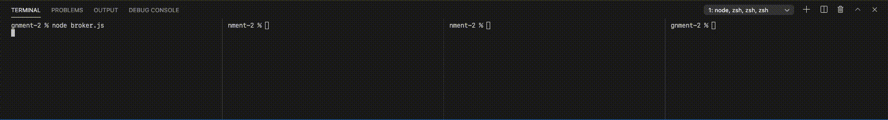
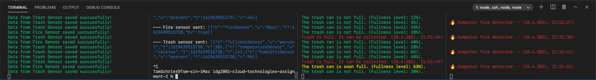

# Obligatory assignment 2 – IDG2001 - Cloud Technologies

## More brilliant trash collection for better air quality

Our IoT scenario extends the classic smart collecting by emphasizing better air quality. In addition to notifying when the trash is full, our trash can also inform when the trash in the trash can is humid and warm. This trash can often contribute to a foul smell and an increase in rodents. We, therefore, want to prioritize emptying these trash cans.

Our smart trash can also has a smoke detector inside it, allowing the fire department to be notified of potential dumpster fires. Controlling dumpster fires is essential because burning waste can pollute the air with toxins, contributing to harmful and unhealthy air quality.

## Installation
Use a package manager to install the project dependencies. During development, we used npm.
For example, `npm install`

## Usage
The project has multiple files that need to run. In separate terminals run the files '`broker.js`', '`publisher.js`', '`sub_fire_department.js`' and '`sub_trash_collection.js`'

For example write each command in seperate terminals:

`node broker.js`

`node publisher.js`

`node sub_fire_department.js`

`node sub_trash_collection.js`

All the files will connect to the Broker. Then the publisher will start to publish both Fire Sensor data and Trash Sensor data. The subscriber then receives this data because they are subscribers to each of their topics.
The subscribers will react to the incoming message based on the values. For example, the subscriber will let the user know when there is a fire, if the trash is almost full, or if the trash is full and ready to be collected.

## Multiple versions
**Note:** Our project has multiple versions. Each version has its type of payload. The task description states "Implementation of SenML/JSON and SenML/XML as payload" + "Implementation of SenML/EXI as payload".

We decided to do a version with each type because we did not want to clutter our project with different payload types.

-   In the folder "SenML/JSON payload", the payload used is JSON in the SenML format – nothing else. (You could consider this the main folder).
-   In the folder "SenML/XML payload", the payload used is XML in the SenML format1.
-   In the folder "SenML/EXI payload", We tried to convert the sensor data to EXI, although this created problems when publishing the payload with MQTT/Mosca.2 Converting the JSON to EXI and EXI to JSON worked perfectly, as long as it happens in the same file (doubtful of its usefulness). We wanted to include this folder to show that the group has tried and, to some degree, managed to convert JSON to EXI.

1 Due to the rules of well-formed XML, we had to create a custom outer element for the Trash sensor in the XML payload. Otherwise, the npm JSON/XML converter can not convert the data back to JavaScript.

2The error we got was "`Error: Distinguishing Bits are 0.`" This error only happens when the EXI is converted to a string (it must be a string to be published). We also tried not converting to a string, but then the Broker could not understand the message. We asked for help from another student group, and they thought it might be because of Mosca, although we are unsure. When Googleing the error, no search results were found, making it hard for us to solve the problem. The EXI documentation states, ["Unlike the optional EXI cookie that MAY occur to precede this field, the presence of Distinguishing Bits is REQUIRED in the EXI header."](https://www.w3.org/TR/exi/#DistinguishingBits) But does not show how to include these 'Distinguishing Bits'.

## Database connection and table structure
For this project, we are storing some of the sensor data in MongoDB Atlas. We have attached some screenshots of the database in the delivery folder, displaying its table layout.

All the data from the Trash Sensor is saved in the database. On the other hand, only the information from the Fire Sensor is saved if it detects a fire (isBurning === true). Only saving valuable data can reduce the amount of clutter in the database.

We also use Mongoose to check if the data being saved to the database is of the type (string/number) we expect. This way, Mongoose can warn us if we send the wrong data to the database before it is saved.

## Demo
We have created a small GIF/video to demonstrate the expected results.

### Expected result:

## Authors
- Tom Schrier
- Ingunn Hatlehol Andreassen

## Contributors
A lot of the code is based on the code provided by Sankini Rancha Godage.